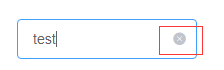
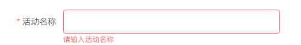
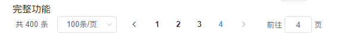

# UI规范
###### UI框架使用ElementUI 风格使用ElementUI的默认风格 颜色：__#409EFF__

###组件规范
1. 按钮规范
   * 颜色
       * 默认：#409EFF
       * 成功：#67C23A
       * 警告：#E6A23C
       * 危险：#F56C6C
       * 信息：#909399
       * 文字颜色：#FFFFFF   
       * 规格
          * 尺寸：使用默认大小
          * 圆角：使用非圆角按钮
2. input输入框
   * 必须有placeholder属性
   * 必须有clearable属性（可清空按钮）

   
   * 表单校验样式

   

   * 表单必须做非空校验
3. 分页样式
   * 风格

   
   * 对齐方式：中间对齐
